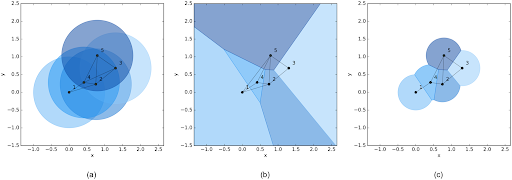

# CG-rDel-Flocking
 Python implementation of "A flocking algorithm for multi-agent systems" by Chenlong He, Zuren Feng, and Zhigang Ren
by Tristan Haeger

The code is all in the CGFlockFinal notebook and is fairly well documented, so feel free to follow the instructions and play around!

This implementation of boids differs from usual approaches as it does not use a radius around agents to find neighbors. Rather, we use the Voronoi and then discard neighbors that don't share a Voronoi edge within a r/2 radius around the agent.
Here is a comparison of an r-limited graph compared to an r-limited Delaunay graph.
-  

The paper also provides a great visualization for their approach.
- 

When paired with the usual alignment, seperation, and cohesion rules, our boids no longer have neighboring edges that overlap, improving the performance of the algorithm.

  

